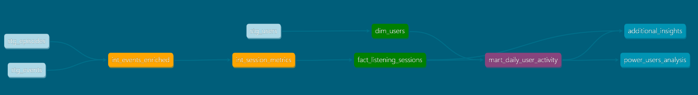

# Podcast Analytics

This project implements a complete analytics solution for podcast streaming data using **dbt** and **DuckDB**.

## 🏗️ Architecture Overview

The solution follows a **3-layer medallion architecture**:

### **Data Flow:**
```
Sources → Staging → Intermediate → Marts
```

**Layer Details:**
- **Sources**: Raw CSV files (`event_logs.csv`, `users.csv`, `episodes.csv`)
- **Staging**: Data cleaning, validation, and type conversion (`stg_*` models as views)
- **Intermediate**: Business logic, enrichment, and complex transformations (`int_*` models as views)
- **Marts**: Analytics-ready dimensional models and aggregations (`dim_*`, `fact_*`, `mart_*` as tables)

**Materialization Strategy:**
- **Views** (staging + intermediate): Fast development, always fresh, no storage overhead
- **Tables** (marts): Optimized performance for end-user queries and BI tools

### **Models by Layer:**

**Staging (3 models - Views):**
- `stg_events`: Clean event data with timestamp validation
- `stg_users`: User demographics with data quality checks
- `stg_episodes`: Episode metadata with duration validation

**Intermediate (2 models - Views):**
- `int_events_enriched`: Events joined with episode metadata
- `int_session_metrics`: Session-level aggregations and calculations

**Marts (4 models - Tables):**
- `dim_users`: User dimension with lifecycle cohorts
- `dim_episodes`: Episode dimension with duration categories  
- `fact_listening_sessions`: Core fact table with engagement metrics
- `mart_daily_user_activity`: Daily user behavior aggregations

## 📊 Data Model

### Entity Relationship Diagram (ERD)

**3-Layer Architecture with Proper Dependencies:**



### Dimensional Model (Star Schema)

**Dimension Tables:**
- `dim_users`: User demographics and cohort information
- `dim_episodes`: Episode metadata and categorization

**Fact Tables:**
- `fact_listening_sessions`: Daily user-episode interaction metrics with engagement data
  - **Primary Key**: `session_key` (hash of user_id + episode_id + session_date)
  - **Grain**: One record per user per episode per day

**User Marts:**
- `mart_daily_user_activity`: Daily aggregated user behavior metrics for analysis
  - **Grain**: One record per user per day
  - **Purpose**: Power user identification and cohort analysis

### Key Metrics Calculated
- **Listen-through rate**: `total_listen_duration / episode_duration`
- **Session metrics**: Duration, event counts, completion status
- **User engagement scores**: Weighted activity scoring
- **Power user identification**: Users listening to 3+ episodes per day

## Business Rules & Data-Driven Definitions

Instead of arbitrary assumptions, all business logic was derived from actual data analysis:

### Episode Duration Categories

**Data Analysis:**
- Episodes range from 5.8 to 87.6 minutes (actual data)
- **Quartiles**: Q1=32.8min, Median=57.2min, Q3=72.8min
- Distribution shows clear podcast format clusters

**Categories:**
```sql
case 
    when duration_seconds < 2400 then 'Short (< 40 min)'     -- Q1 boundary: Quick content
    when duration_seconds < 3600 then 'Medium (40-60 min)'   -- Around median: Standard format
    when duration_seconds < 4500 then 'Long (60-75 min)'     -- Q3 boundary: Deep dive content
    else 'Extended (75+ min)'                                 -- Top quartile: Long-form content
end
```

**Business Rationale:**
- **Short**: Quick consumption, high completion likelihood
- **Medium**: Standard podcast format, balanced engagement
- **Long**: Deep content, dedicated listening time required
- **Extended**: Premium/specialized content, committed audience

### User Cohorts (Lifecycle-Based)

**Categories:**
```sql
case 
    when days_since_signup <= 90 then 'Recent (0-3 months)'    -- Onboarding phase
    when days_since_signup <= 180 then 'Growing (3-6 months)'  -- Habit formation 
    when days_since_signup <= 365 then 'Loyal (6-12 months)'   -- Established users
    else 'Champion (12+ months)'                                -- Long-term retention
end
```

**Business Rationale:**
- **Recent**: Focus on onboarding, feature discovery
- **Growing**: Habit formation, content recommendation critical
- **Loyal**: Engaged users, upsell opportunities
- **Champion**: Brand advocates, premium features

### Episode Age Categories (Content Lifecycle)

**Categories:**
```sql
case 
    when days_since_release <= 14 then 'Fresh (0-2 weeks)'     -- Peak discovery
    when days_since_release <= 60 then 'Current (2-8 weeks)'   -- Active promotion
    when days_since_release <= 180 then 'Catalog (2-6 months)' -- Searchable library
    else 'Archive (6+ months)'                                  -- Long-tail content
end
```

**Business Rationale:**
- **Fresh**: Push notifications, homepage features
- **Current**: Recommendation algorithms, related content
- **Catalog**: Search results, topic-based discovery  
- **Archive**: SEO content, specialized searches

### Engagement Score (Multi-Factor)

**Data Analysis:**
- Event distribution: play(25.6%), complete(25.2%), seek(24.6%), pause(24.6%)
- All event types have similar frequency - no single dominant action
- Completion indicates content satisfaction

**Formula (Balanced Approach):**
```sql
case 
    when total_listen_duration > 0 then
        round(
            (total_listen_duration / 60.0) * 0.7 +              -- 70% weight on listen time
            (complete_events * 2 + play_events + pause_events + seek_events) * 0.3  -- 30% on interactions
        , 2)
    else (complete_events * 2 + play_events + pause_events + seek_events)
end
```

**Business Rationale:**
- **Listen Duration (70%)**: Primary engagement indicator - time is valuable
- **Completion Bonus (2x)**: Strong satisfaction signal, content quality indicator
- **Interaction Events (Equal)**: All indicate engagement, no single action dominates
- **Fallback**: For sessions without duration, use interaction count

## 🚀 Getting Started

### Prerequisites
- Python 3.8+
- Git

### Quick Setup

1. **Clone the repository:**
```bash
git clone https://github.com/dre-at8865/podcast_analytics.git
cd podcast_analytics
```

2. **Install Python dependencies:**
```bash
pip install -r requirements.txt
```

3. **Install dbt packages:**
```bash
dbt deps
```

4. **Verify setup:**
The project includes a `profiles.yml` file configured for DuckDB. The database will be created as `podcast_analytics.duckdb` in the project root.

**Note**: Source CSV files use relative paths (`sources/`) and will work immediately after cloning.

### Running the Project

1. **Load CSV data into DuckDB:**
```bash
# The sources are configured to read directly from CSV files
# DuckDB will automatically read from the sources/ directory
```

2. **Run dbt models:**
```bash
# Run all models
dbt run

# Run with tests
dbt run && dbt test
```

3. **Generate documentation:**
```bash
dbt docs generate
dbt docs serve
```

### Project Structure
```
├── analyses/              # Analysis queries (4 files)
│   ├── top_episodes_past_7_days.sql
│   ├── listen_through_rate_by_country.sql
│   ├── power_users_analysis.sql
│   └── additional_insights.sql
├── models/
│   ├── staging/          # Data cleaning and validation (3 views)
│   │   ├── stg_events.sql
│   │   ├── stg_users.sql
│   │   ├── stg_episodes.sql
│   │   └── schema.yml
│   ├── intermediate/     # Business logic and enrichment (2 views)
│   │   ├── int_events_enriched.sql
│   │   ├── int_session_metrics.sql
│   │   └── schema.yml
│   ├── marts/           # Analytics-ready models (4 tables)
│   │   ├── dim_users.sql
│   │   ├── dim_episodes.sql
│   │   ├── fact_listening_sessions.sql
│   │   ├── mart_daily_user_activity.sql
│   │   └── schema.yml
│   └── sources.yml      # Source definitions
├── sources/             # Raw CSV files
│   ├── event_logs.csv
│   ├── users.csv
│   └── episodes.csv
├── tests/               # Custom data quality tests
│   ├── test_no_future_events.sql
│   └── test_reasonable_listen_through_rates.sql
├── dbt_project.yml     # Project configuration
├── packages.yml        # Dependencies
└── profiles.yml        # DuckDB connection
```

## 📈 Analysis Queries

The project includes several analysis queries in the `analyses/` folder:

### 1. Top Episodes (Past 7 Days)
```sql
dbt compile --select analyses/top_episodes_past_7_days
```
**Output**: Top 10 most completed episodes with completion counts and listen-through rates.

### 2. Listen-Through Rate by Country
```sql
dbt compile --select analyses/listen_through_rate_by_country
```
**Output**: Average listen-through rates aggregated by user country.

### 3. Power Users Analysis
```sql
dbt compile --select analyses/power_users_analysis
```
**Output**: Users who listened to 3+ different episodes in one day.

### 4. Additional Insights
```sql
dbt compile --select analyses/additional_insights
```
**Output**: Podcast performance, user cohort analysis, and engagement by episode length.

## 🧪 Data Quality

### Tests Implemented
- **Staging validation**: Null checks, unique constraints, data type validation
- **Referential integrity**: Foreign key relationships between fact and dimension tables
- **Business logic validation**: Listen-through rates (≥ 0, allowing replay behavior), engagement scores
- **Custom tests**: Future event detection, data quality anomaly detection
- **Expression tests**: Duration validation, positive values enforcement

### Running Tests
```bash
# Run all tests
dbt test

# Run tests for specific models
dbt test --select stg_events
```

## ⚙️ Orchestration Considerations

For production deployment, consider:

### Airflow DAG Structure
```python
# Example DAG outline
extract_data_task >> dbt_run_task >> dbt_test_task >> notify_task
```

### Incremental Processing
- **Staging models**: Keep as views (not incremental) for simplicity and debugging
- **Fact tables**: Consider incremental materialization for large datasets based on `event_timestamp`
- **Marts**: Implement incremental logic for daily aggregations
- Add partition pruning and backfill logic for historical data reprocessing

### Monitoring
- Set up dbt test notifications
- Monitor data freshness
- Track model run times and failures

## 🎯 Key Design Decisions

### 1. **Session Definition**
- **Decision**: Define sessions as daily user-episode interactions (one session per user per episode per day)
- **Rationale**: Simplified approach that aggregates all user interactions with an episode on a given day

### 2. **Listen-Through Rate Calculation**
- **Decision**: `total_listen_duration / episode_duration`
- **Rationale**: Accounts for replays and partial listens, can exceed 100%

### 3. **Power User Definition**
- **Decision**: 3+ different episodes per day
- **Rationale**: Indicates high engagement while being achievable for active users

### 3. **Materialization Strategy**
- **Staging/Intermediate**: Views (for flexibility and cost)
- **Marts**: Tables (for performance in analytics queries)

### 4. **Session Key Design**
- **Decision**: Generate session_key from `user_id + episode_id + session_date`

## 📝 Assumptions Made

1. **Duplicate Events**: Removed duplicates based on user_id, episode_id, timestamp, and event_type
2. **Missing Durations**: Only play/complete events should have duration values
3. **Timezone**: All timestamps assumed to be in UTC
4. **Data Quality**: Events without user_id, episode_id, or valid timestamps are filtered out
5. **Session Granularity**: Daily aggregation (one session per user per episode per day)
6. **Analysis Period**: Using configurable `analysis_date` variable for testing consistency

## 🔍 Sample Queries

### Most Engaged Users by Country
```sql
SELECT 
    u.country,
    COUNT(DISTINCT s.user_id) as active_users,
    AVG(s.engagement_score) as avg_engagement
FROM fact_listening_sessions s
JOIN dim_users u ON s.user_id = u.user_id
GROUP BY u.country
ORDER BY avg_engagement DESC;
```

### Episode Performance Dashboard
```sql
SELECT 
    e.title,
    COUNT(DISTINCT s.user_id) as unique_listeners,
    AVG(s.listen_through_rate) as avg_completion_rate,
    SUM(s.completed_episode) as total_completions
FROM fact_listening_sessions s
JOIN dim_episodes e ON s.episode_id = e.episode_id
GROUP BY e.title
ORDER BY unique_listeners DESC;
```
